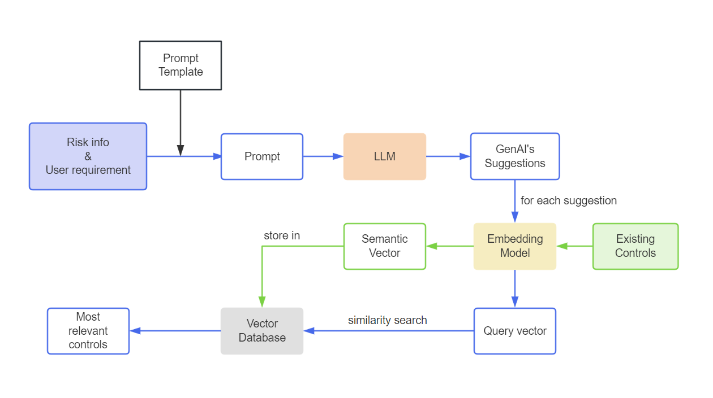
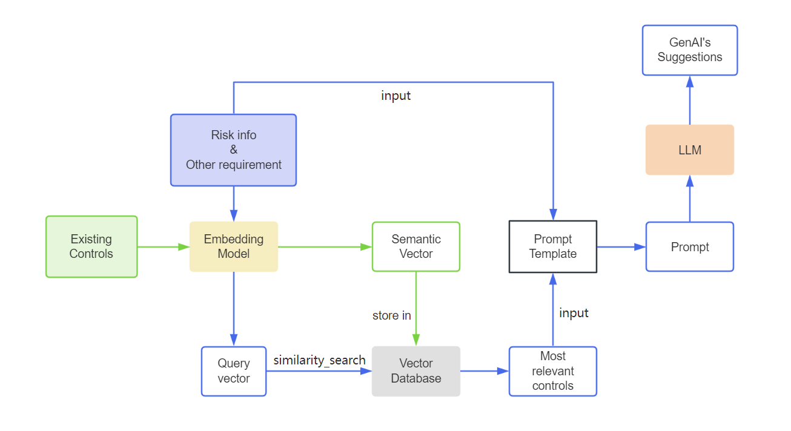

# LangChain Research Project

The LangChain Research project aims to explore the integration of LangChain with the SAP Generative AI Hub. LangChain is a tool for language generation and processing, while SAP Generative AI Hub provides a platform for leveraging generative AI models developed by SAP.

## Project Overview

The primary objective of the LangChain Research project is to pave the way for future projects where generative AI can be applied to enhance user experience. By integrating LangChain with the SAP Generative AI Hub, we aim to investigate how generative AI models can be utilized to provide users with more enriching and personalized experiences in various applications.

## Project Structure
The project directory structure is organized as follows:

- **CustomModel/**: This directory contains custom models developed as part of the LangChain Research project.
  - `CustomLLM.py`: A Python file within the `CustomModel` directory that serves as a custom encapsulation of the LangChain LLM module. This module facilitates interaction with the SAP Generative AI Hub's APIs.
  - `CustomEmbedding.py`: The CustomEmbedding.py file inherits from Langchain's Embeddings class and wraps the embedding interface provided by SAP GenAI Hub into an Embedding class suitable for Langchain. With this custom class, you can conveniently utilize the embedding interface provided by SAP GenAI Hub within Langchain.
  - `RAG.py`: The RAG.py file contains two custom RAG classes, which both include a `call_your_api` method. The method parameters include `input_data`, representing user input content, `path` indicating the path to the existing CSV dataset, `collection_name` as a parameter in PGEmbedding. 
    - By using `RAG` class, you can retrieve responses from GenAI and access data from your existing dataset that is similar to the responses generated by the AI.
      [](./img/default_rag_procedure.png?raw=true)
    - By using `RAGplus` class, you can firstly access controls from exsiting dataset that is related to the given risk info and then retrieve responses from GenAI which include analysis about the relevant controls and addition control suggestions.
      [](./img/default_rag_procedure.png?raw=true)

- **prompt-template-demo/**: This directory contains a demo application built using LangChain's Model I/O module. Users can input simple descriptions of risks on a web page and receive suggestions for treatments.
  - `app.py`: Python file to run the Flask web application.
  - Other files and directories related to the demo application.

- **retrieval-demo/**: The project under the retrieval-demo directory implements a simple RAG (Retrieval-Augmented Generation) application. Upon launching the application, users are presented with a web page where they can input a description of a risk. The system then provides risk-related control suggestions generated by AI, along with relevant suggestions from our existing risk control data. This application leverages the capabilities of RAG to enhance user experience by providing both AI-generated suggestions and suggestions retrieved from our dataset, thereby offering a comprehensive set of risk control recommendations.
  - `app.py`: Python file to run the Flask web application.
  - Other files and directories related to the demo application.

- **LangChain.ipynb**: This is a Jupyter Notebook file included in the project. It serves as a sandbox environment for exploring the basic functionalities and methods available in LangChain. This notebook allows researchers and developers to experiment with various language generation and processing tasks within the LangChain framework.

## Getting Started

To get started with the LangChain Research project, follow these steps:

1. Clone the project repository from GitHub.

2. Create an `.env` file in the root directory:

    ```
    CLIENT_ID=<client_id>
    CLIENT_SECRET=<client_secret>
    AUTH_URL=<auth_api_url>
    LLM_API_URL=<llm_api_url>
    EMBEDDING_API_URL=<embedding_api_url>
    POSTGRES_CONNECTION_URL=<postgres_connection_string>
    ```

3. Ensure that all the required Python libraries are installed by using the `requirements.txt` file provided in the root directory of the project. You can install the dependencies using the following command:

    ```
    pip install -r requirements.txt
    ```

3. Navigate to the `prompt-template-demo` or `retrieval-demo` directory.

4. Run the `app.py` file using the following command:

    ```
    python app.py
    ```

5. Once the application is running, you can access it by navigating to `http://127.0.0.1:5000/` in your web browser. This will open a demo page where users can input a simple description of a risk and receive suggestions for controls.

## Conclusion

The LangChain Research project serves as a foundational exploration for future projects where generative AI can enhance user experiences. By integrating LangChain with the SAP Generative AI Hub, we aim to unlock the potential of generative AI models to provide users with more enriching and personalized experiences across various applications.

